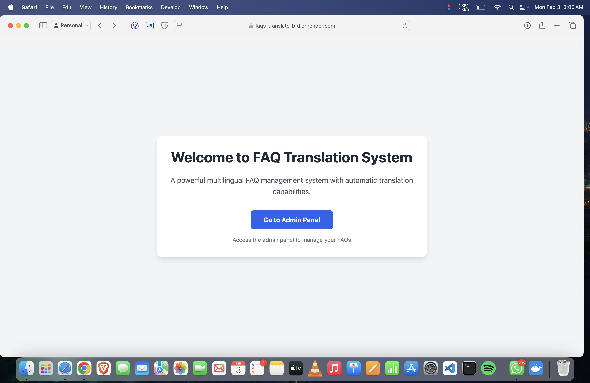
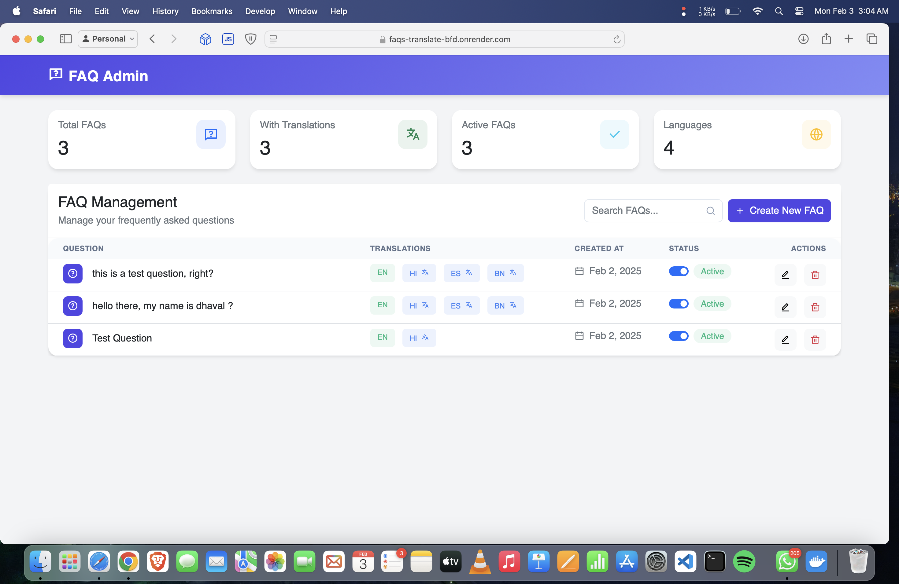
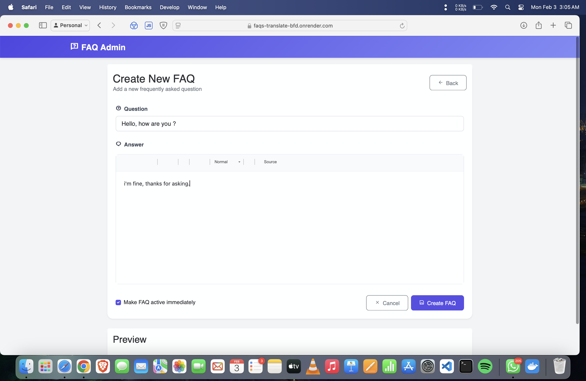
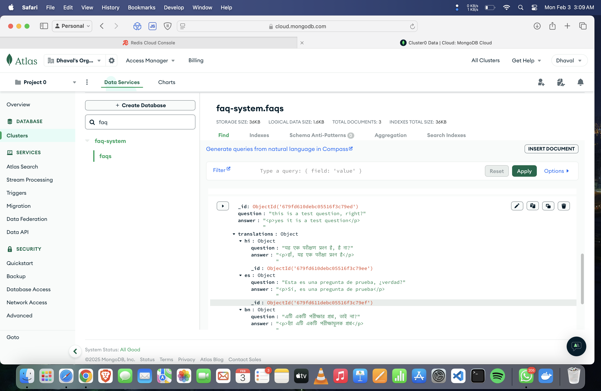
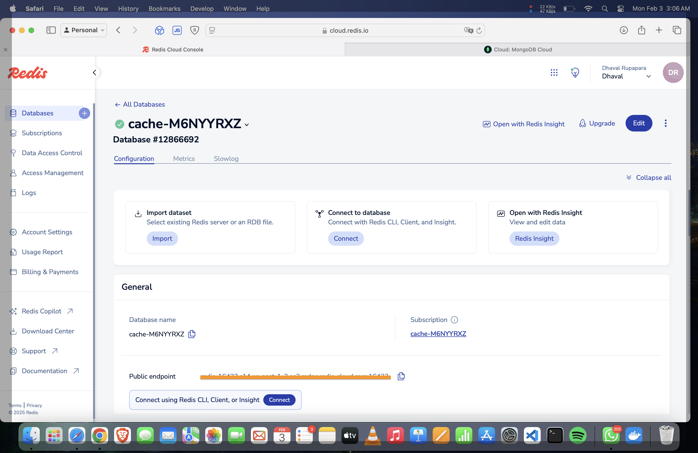

# FAQ Translation System

A robust multilingual FAQ management system built with Node.js, Express, and MongoDB. The system supports dynamic translation of FAQs into multiple languages with advanced caching mechanisms for optimal performance.


## Public URLs

- **Wait for 5-10s for it to load as it is on free tier temporary**

- **Production URL**: [https://faqs-translate-bfd.onrender.com](https://faqs-translate-bfd.onrender.com)
- **Test/Staging URL**: [https://faqs-translate-bfd.onrender.com](https://faqs-translate-bfd.onrender.com)


## Screenshots







##  Features

- Multi-language FAQ management with automatic translation
- WYSIWYG editor for rich text content
- Redis caching for improved performance
- RESTful API with language selection support
- Secure admin panel for content management
- Comprehensive test coverage
- Docker support for easy deployment
- MongoDB Atlas Cloud integration
- Express session management with Flash messages
- Helmet security middleware
- CORS enabled
- Method override support
- EJS templating with layouts

##  Technology Stack

- **Backend**: Node.js, Express.js
- **Database**: MongoDB Atlas Cloud
- **Caching**: Redis Cloud
- **Testing**: Mocha/Chai
- **Container**: Docker
- **Template Engine**: EJS
- **Code Quality**: ESLint, Prettier
- **Version Control**: Git
- **Security**: Helmet, CORS
- **Logging**: Morgan
- **Session Management**: express-session
- **Flash Messages**: connect-flash


##  Admin Testing

### Test Admin Credentials
```
URL: https://faqs-translate-bfd.onrender.com/admin

```

1. **FAQ Management Testing**
   ```bash
   # Create FAQ
   curl -X POST https://faqs-translate-bfd.onrender.com/admin/faqs/create \
     -H "Content-Type: application/json" \
     -H "Cookie: session=your_session_cookie" \
     -d '{
       "question": "Test Question",
       "answer": "<p>Test Answer</p>"
     }'
    ```

### Admin Testing Checklist

1. **Mandatory Tests**
   - [✅] Session persistence

2. **FAQ Management Tests**
   - [✅]  Create new FAQ
   - [✅]  Edit existing FAQ
   - [✅]  Delete FAQ
   - [✅]  View FAQ list
   - [✅]  Search FAQs

3. **Translation Tests**
   - [✅]  Auto-translation on FAQ creation
   - [✅]  Manual translation override
   - [✅]  Translation preview
   - [✅]  Multi-language support verification

4. **WYSIWYG Editor Tests**
   - [✅]  Rich text formatting
   - [✅]  Image upload
   - [✅]  HTML cleaning
   - [✅]  Content preview

5. **Cache Management Tests**
   - [✅]  Cache creation
   - [✅]  Cache invalidation
   - [✅]  Cache update
   - [✅]  Performance verification


##  Prerequisites

- Node.js (v14 or higher)
- MongoDB Atlas account
- Redis Cloud account
- Docker and Docker Compose (optional)
- Google Translate API credentials or Azure

##  Installation

1. Clone the repository:
```bash
git clone https://github.com/yourusername/faq-translation-system.git
cd faq-translation-system
```

2. Install dependencies:
```bash
npm install
```

3. Configure environment variables:
```bash
cp .env.example .env
```

Required environment variables:
```env
PORT=3000
MONGODB_URI=your_mongodb_atlas_uri
REDIS_URL=your_redis_cloud_url
SESSION_SECRET=your_session_secret
GOOGLE_TRANSLATE_API_KEY=your_google_translate_api_key
NODE_ENV=development_mode
AZURE_TRANSLATOR_KEY=your_acuze_api_key
AZURE_TRANSLATOR_ENDPOINT=your_azure_endppint
AZURE_TRANSLATOR_REGION=your_azure_region
```

4. Run the application:
```bash
# Development mode
npm run dev

# Production mode
npm start
```

##  API Routes

### API Endpoints
Base URL: `/api`

| Method | Route | Description |
|--------|-------|-------------|
| GET | `/api/faqs` | Retrieve all FAQs. Supports language query parameter (`?lang=`) |
| GET | `/api/faqs/search` | Search FAQs with query parameters |
| GET | `/api/faqs/:id` | Retrieve a specific FAQ by ID |

### Admin Routes
Base URL: `/admin`

| Method | Route | Description |
|--------|-------|-------------|
| GET | `/admin` | Admin dashboard |
| GET | `/admin/faqs/create` | Show FAQ creation form |
| POST | `/admin/faqs/create` | Create new FAQ |
| GET | `/admin/faqs/:id/edit` | Show FAQ edit form |
| PUT | `/admin/faqs/:id` | Update existing FAQ |
| DELETE | `/admin/faqs/:id` | Delete FAQ |

### Example API Usage

```bash
# Get all FAQs
curl http://localhost:3000/api/faqs

# Get FAQs in Hindi
curl http://localhost:3000/api/faqs?lang=hi

# Search FAQs
curl http://localhost:3000/api/faqs/search?q=payment&lang=en

# Get specific FAQ
curl http://localhost:3000/api/faqs/123456789
```

### Example Admin API Usage

```bash
# Create new FAQ (requires authentication)
curl -X POST http://localhost:3000/admin/faqs/create \
  -H "Content-Type: application/json" \
  -d '{
    "question": "What is this service?",
    "answer": "<p>This is a multilingual FAQ system.</p>"
  }'

# Update FAQ (requires authentication)
curl -X PUT http://localhost:3000/admin/faqs/123456789 \
  -H "Content-Type: application/json" \
  -d '{
    "question": "Updated question",
    "answer": "<p>Updated answer</p>"
  }'
```

##  Docker Deployment

1. Build and run using Docker Compose:
```bash
docker-compose up --build
```

2. Docker environment configuration:
```yaml
# docker-compose.yml
version: '3.8'
services:
  app:
    build: .
    ports:
      - "3000:3000"
    environment:
      - NODE_ENV=production
      - MONGODB_URI=your_mongodb_uri
      - REDIS_URL=your_redis_url
```

The application will be available at `http://localhost:3000`

##  Security Features

- **Helmet**: Secure HTTP headers
- **CORS**: Configurable Cross-Origin Resource Sharing
- **Session Management**: Secure session handling
- **CSP**: Content Security Policy for resources
- **Method Override**: Secure handling of PUT/DELETE requests

##  Documentation

### API Response Format

Success Response:
```json
{
  "success": true,
  "data": {
    "faqs": [
      {
        "id": "123",
        "question": "What is this?",
        "answer": "<p>This is a FAQ system</p>",
        "translations": {
          "hi": {
            "question": "यह क्या है?",
            "answer": "<p>यह एक FAQ सिस्टम है</p>"
          }
        }
      }
    ]
  }
}
```

Error Response:
```json
{
  "success": false,
  "error": {
    "code": "ERROR_CODE",
    "message": "Error description"
  }
}
```

##  Testing

```bash
# Run all tests
npm test

# Run unit tests only
npm run test:unit

# Run integration tests only
npm run test:integration

# Generate coverage report
npm run test:coverage
```

Test files structure:
```
test/
├─ unit/
│  ├─ basic.test.js
│  └─ faq.model.test.js
├─ integration/
│  ├─ admin.test.js
│  └─ api.test.js
├─ setup.js
└─ test-config.js
```

##  Database Schema

FAQ Model:
```javascript
{
  question: { type: String, required: true },
  answer: { type: String, required: true },
  translations: {
    hi: {
      question: String,
      answer: String
    },
    bn: {
      question: String,
      answer: String
    }
  },
  createdAt: Date,
  updatedAt: Date
}
```

##  Caching Strategy

Redis caching implementation:
- Cache key format: `faq:{id}:{lang}`
- Default TTL: 24 hours
- Auto-invalidation on updates
- Fallback to database on cache miss

##  Project Structure

```
faq-translation-system/
├─ src/
│  ├─ app.js           # Express app setup
│  ├─ config/          # Configuration files
│  ├─ controllers/     # Request handlers
│  │  ├─ adminController.js
│  │  └─ apiController.js
│  ├─ middleware/      # Custom middleware
│  ├─ models/          # Database models
│  │  └─ faq.js
│  ├─ routes/          # API routes
│  │  ├─ admin.js
│  │  └─ api.js
│  ├─ utils/          # Helper functions
│  │  ├─ cache.js
│  │  └─ translator.js
│  └─ views/          # EJS templates
│     ├─ admin/
│     │  ├─ create-faq.ejs
│     │  ├─ dashboard.ejs
│     │  └─ edit-faq.ejs
│     └─ layouts/
│        └─ main.ejs
└─ test/             # Test files
```

##  Supported Languages

- English (en) - Default
- Hindi (hi)
- Bengali (bn)

##  Error Handling

Custom error handling middleware for:
- 404 Not Found
- 500 Internal Server Error
- Validation Errors
- Authentication Errors

##  Contributing

1. Fork the repository
2. Create a feature branch: `git checkout -b feature/new-feature`
3. Commit changes: `git commit -am 'feat: Add new feature'`
4. Push to the branch: `git push origin feature/new-feature`
5. Submit a Pull Request

##  License

This project is licensed under the MIT License - see the LICENSE file for details.

## Acknowledgments

- Express.js team
- MongoDB Atlas
- Redis Cloud
- Google Cloud Translation API
